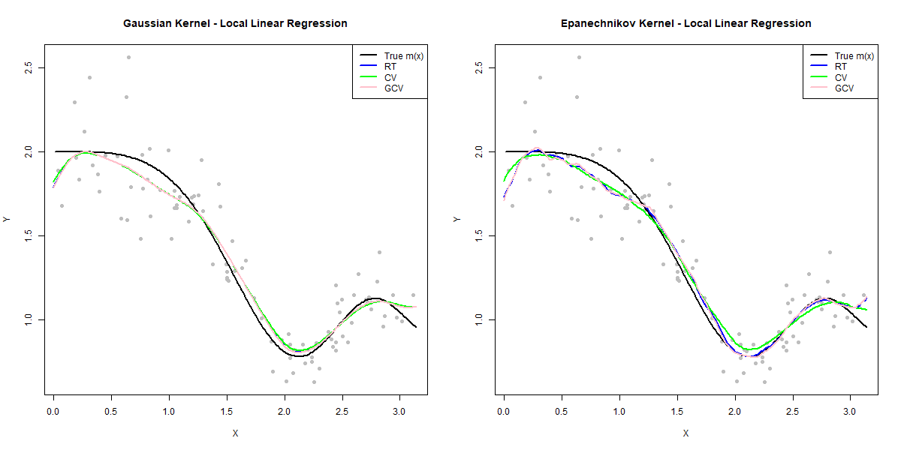
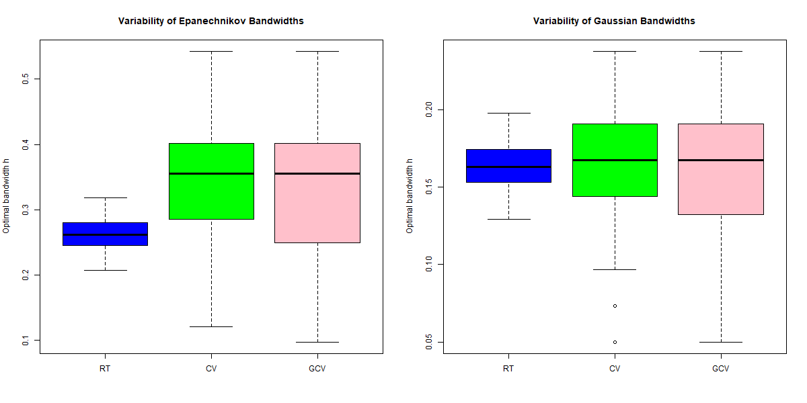

# Excersise 5 

## b

| Kernel | Rule.of.Thumb | CV | GCV |
|--------|---------------|-----|--------|
| Epanechnikov | 0.2727964 | 0.4489796 | 0.2377551 |
| Gaussian | 0.1700174 | 0.1908163 | 0.1673469 |

### Comments on the optimal bandwidths

- **Rule-of-Thumb (RT)** yields relatively small and stable bandwidths, as it is based on theoretical assumptions about the smoothness of the regression function.
- **Cross-Validation (CV)** selects larger bandwidths, reflecting a stronger smoothing effect to reduce variance caused by random noise.
- **Generalized Cross-Validation (GCV)** produces bandwidths that lie between RT and CV, indicating a balance between bias and variance.

Overall, the different bandwidth selection methods lead to different optimal values, highlighting the crucial role of bandwidth in local linear regression.
## c

### Trend estimation using local linear regression

All estimated curves closely follow the true regression function \(m(x)\), especially in regions with sufficient data.

For the **Gaussian kernel**, the estimated curves obtained using RT, CV, and GCV are very similar and almost overlap.  
This suggests that the Gaussian kernel is relatively insensitive to the choice of bandwidth selection method, resulting in stable and smooth estimates.

In contrast, for the **Epanechnikov kernel**, noticeable differences among the RT, CV, and GCV estimators can be observed, particularly in regions with strong curvature, where CV and GCV are more adaptive to local features.

Overall, both **Gaussian** and **Epanechnikov** kernels provide similar trend estimates of the regression function.  
The Gaussian kernel tends to produce slightly smoother curves, while the Epanechnikov kernel is marginally more responsive to local variations.  
These results indicate that the choice of bandwidth has a stronger impact on the estimator than the choice of kernel.

## d

### Variability of optimal bandwidths

The boxplots show noticeable variability in the optimal bandwidths obtained across 100 simulated datasets.

For both kernels, the **Rule-of-Thumb (RT)** method produces the most stable bandwidths, with the smallest dispersion, reflecting its deterministic and assumption-based nature.  
In contrast, **CV** and **GCV** exhibit larger variability, indicating higher sensitivity to random noise in the data.

For the **Epanechnikov kernel**, the variability of bandwidths selected by CV and GCV is more pronounced, with a wider spread and more extreme values.  
For the **Gaussian kernel**, the bandwidths are generally smaller and show less variability, consistent with the smoother and more stable nature of the Gaussian kernel.

Overall, these results suggest that data-driven methods such as CV and GCV adapt better to individual datasets but at the cost of higher variability, while RT provides more stable but less adaptive bandwidth choices.
