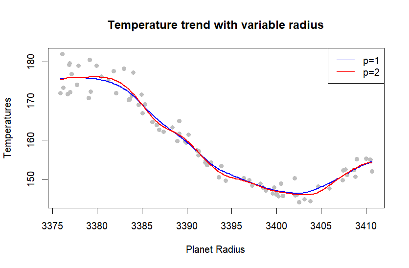
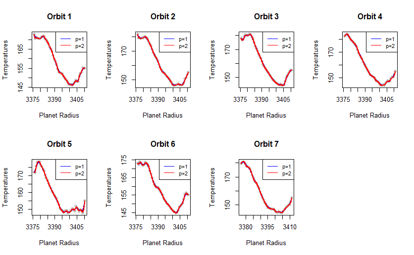
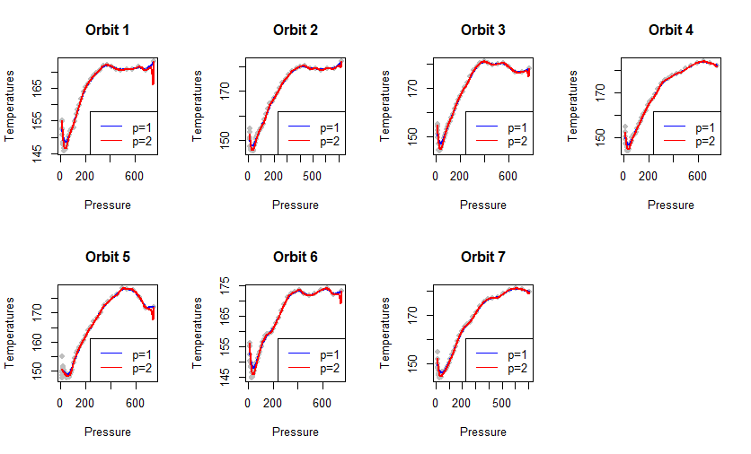

# 4.1

## Summary: The correlation between temperatures and radius is non-linear. The temperature decreases as the radius increases from 3375 to 3400, and then begins to increase gradually.

# 4.2

## Summary: The temperature decreases as the radius increases from 3375 to 3400 at all the orbits. Before the radius reaches 3375, there isn't a specific correlation between radius and temperature across the orbits. After the radius exceeds 3400, the temperature tends to increase as the radius increases but the correlation is non-linear across the orbits.

# 4.3

## Summary: The correlation between temperatures and pressure is non-linear. The temperature decreases as the pressure increases from 50 to 400 at all the orbits. Before the pressure reaches 50, the temperature decreases sharply as the pressure increases across the orbits, then the temperature increases sharply. After the pressure exceeds 400, the temperature tends to saturate betwwen 165 and 175.
